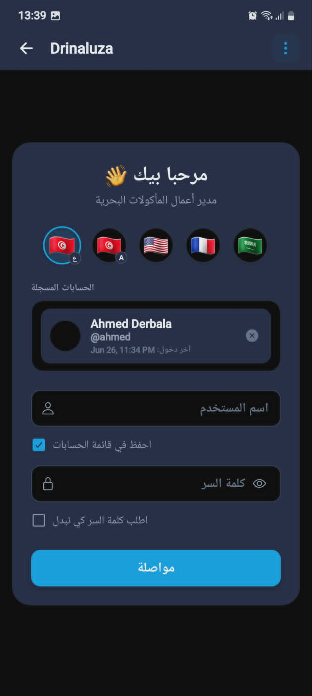
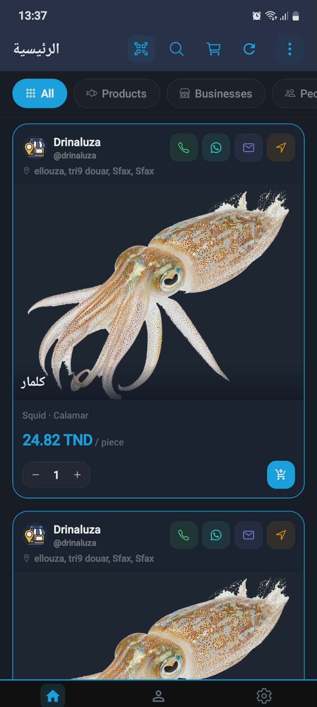
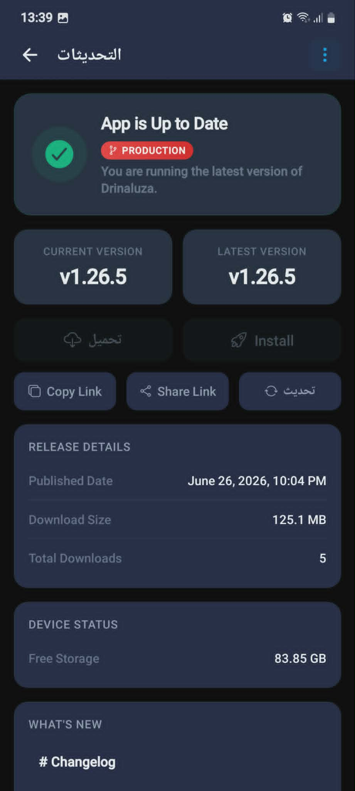

# drinaluza Releases 🚀

This repository serves as the public distribution channel for the **drinaluza** platform binaries (APK).

---

[website](https://drinaluza.com/)
---

## 🎬 App Demo

  

*~45 second walkthrough of the Drinaluza marketplace experience on web.*

---

## 📱 Screenshots

<!-- SCREENSHOTS_START -->

  
  
  
  
  
  
  
  
  
  

<!-- SCREENSHOTS_END -->

---

## Top features:
- easy account creation
- buy and sell seafood products and maritime equipements
- rent jet ski, boat trip and coastal houses
- weather tailored for swimming and fishing
- fishermen crew management
- track boats and talk to them with or without internet

---

## Tech used
versions are always latest LTS
frontend: expo, typescript
backend: express.js, javascript
database: mongodb
development tools: linux mint debian edition LMDE, devin, antigravity, opencode, vscode, codium, postman

---

## 👨‍💻 Social Media

🔗 [Facebook](https://www.facebook.com/drinaluza)
🔗 [Tiktok](https://www.tiktok.com/@drinaluza)

---

## 👨‍💻 Author

**Ahmed Derbala**

🔗 [LinkedIn Profile](https://www.linkedin.com/in/ahmed-derbala/)
🔗 [LinkedIn Company Page](https://www.linkedin.com/company/drinaluza/)

---

## Deployment Status

